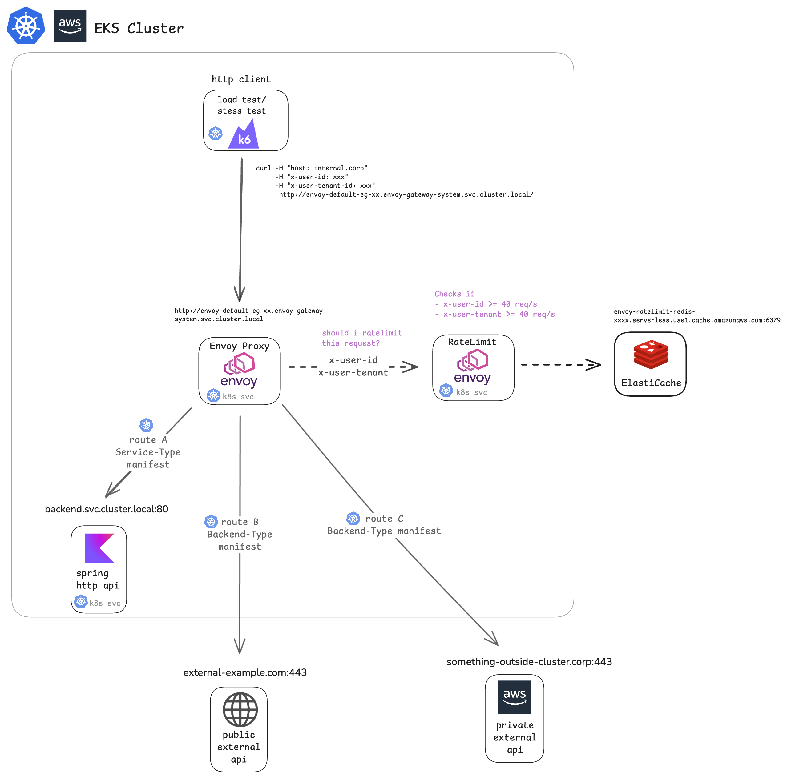

# Envoy Gateway Rate Limiting Precision Testing

A comprehensive project to test and validate the precision of Envoy Gateway's distributed rate limiting capabilities using Kubernetes Gateway API and Redis-backed rate limiting.



## 📋 Table of Contents

- [Overview](#overview)
- [Architecture](#architecture)
- [Envoy Gateway Configuration](#envoy-gateway-configuration)
- [Rate Limit Policies](#rate-limit-policies)
- [Load Testing with k6](#load-testing-with-k6)
- [Test Results & Insights](#test-results--insights)
- [Prerequisites](#prerequisites)

---

## Overview

This project demonstrates and validates Envoy Gateway's distributed rate limiting capabilities in a Kubernetes environment. The goal is to test the **precision** of rate limiting under various scenarios, including:

- **Per-user rate limiting** using distinct header values
- **Per-tenant rate limiting** with shared limits across multiple users
- **Mixed traffic patterns** to validate accurate enforcement at scale

The testing infrastructure processes **~175,000 requests over 60 seconds** across 6 concurrent scenarios to validate rate limit accuracy and system performance.

---

## Architecture

### Components

1. **Envoy Gateway** (`v1.6.0`)
   - Kubernetes Gateway API implementation
   - Manages Envoy Proxy lifecycle
   - Configures distributed rate limiting via `BackendTrafficPolicy`

2. **Envoy Proxy** (Data Plane)
   - Deployed as part of Gateway class
   - Enforces rate limits on incoming traffic
   - Forwards rate limit checks to external rate limit service
   - 3 replicas with 500m-2000m CPU, 512Mi-1Gi memory

3. **Rate Limit Service**
   - Envoy rate limit daemon (deployed by Envoy Gateway)
   - Uses Redis as a distributed counter backend
   - 3 replicas with 500m-1500m CPU, 256Mi-512Mi memory
   - 20ms timeout with `failClosed: false` (fail-open mode)

4. **Redis Backend**
   - AWS ElastiCache Serverless Redis
   - Provides distributed rate limiting state
   - TLS-enabled connection
   - Location: `envoy-ratelimit-redis-pr7hih.serverless.use1.cache.amazonaws.com:6379`

5. **Backend Services**
   - Sample Kotlin backend service (8 replicas)
   - Serves as the upstream service being protected
   - Integrated with Datadog APM for observability

6. **k6 Load Testing**
   - Grafana k6 for load generation
   - 6 concurrent scenarios testing different rate limit rules
   - ~2,914 RPS aggregate load

7. **Observability Stack**
   - Datadog Agent for metrics, traces, and logs
   - OpenMetrics integration for Envoy proxy metrics
   - Custom dashboards for rate limit visualization

### Traffic Flow

1. Client sends request to Envoy Proxy
2. Envoy Proxy extracts headers (`x-user-id`, `x-user-tenant-id`)
3. Envoy forwards to Rate Limit Service for decision
4. Rate Limit Service checks/increments counter in Redis
5. If under limit → request forwarded to backend (HTTP 200)
6. If over limit → request rejected (HTTP 429)

---

## Envoy Gateway Configuration

### Gateway Deployment

The Envoy Gateway is deployed via Helm with high-performance settings:

**Key Configuration** ([envoy-gateway-helm-values.yaml](infra/helm-values/envoy-gateway-helm-values.yaml)):

```yaml
config:
  envoyGateway:
    rateLimit:
      backend:
        type: Redis
        failClosed: false  # Fail-open: allow traffic if rate limiter unavailable
        timeout: 20ms # Ratelimiter timeout
        redis:
          url: "envoy-ratelimit-redis-pr7hih.serverless.use1.cache.amazonaws.com:6379"
    
    provider:
      kubernetes:
        rateLimitDeployment:
          replicas: 3
          container:
            resources:
              requests: { cpu: "500m", memory: "256Mi" }
              limits: { cpu: "1500m", memory: "512Mi" }

```

## Rate Limit Policies

The project uses Envoy Gateway's `BackendTrafficPolicy` CRD to define rate limits. Two main policies are configured:

### Internal Backend Rate Limit (40 RPS)

**Policy:** [internal-backend-40tps-policy.yaml](infra/kubernetes-manifests/envoy-rate-limit-policies/internal-backend-40tps-policy.yaml)

```yaml
apiVersion: gateway.envoyproxy.io/v1alpha1
kind: BackendTrafficPolicy
metadata:
  name: policy-backend
spec:
  targetRefs:
    - kind: HTTPRoute
      name: backend  # Applied to internal backend route
  
  rateLimit:
    type: Global
    global:
      rules:
        # Rule 1: Per-user rate limit
        - clientSelectors:
            - headers:
                - type: Distinct  # Each unique value gets its own limit
                  name: x-user-id
          limit:
            requests: 40
            unit: Second
        
        # Rule 2: Per-tenant rate limit
        - clientSelectors:
            - headers:
                - type: Distinct  # Each unique value gets its own limit
                  name: x-user-tenant-id
          limit:
            requests: 40
            unit: Second
```

**How it works:**
- **Distinct Type**: Each unique header value gets an independent 40 RPS quota
- **Two Rules**: Both `x-user-id` AND `x-user-tenant-id` are enforced
- **First Match Wins**: If either rule triggers (user hits 40 RPS OR tenant hits 40 RPS), request is rate limited

## Load Testing with k6

### Test Design Philosophy

The k6 test suite is designed to validate rate limiting **precision** across various scenarios:

1. **Baseline scenarios** (expect 100% success)
2. **Over-limit scenarios** (expect precise % of 429s)
3. **Shared vs unique identifiers** (test both rule types)

### Test Configuration

**Test Parameters** ([k6-load-test.yaml](infra/kubernetes-manifests/k6-load-test/k6-load-test.yaml)):

| Scenario | Users | RPS/User | Total RPS | Duration | Expected Outcome |
|----------|-------|----------|-----------|----------|------------------|
| **A** | 25 unique pairs | 38 | 950 | 60s | 100% success (200 OK) |
| **B** | 40 unique pairs | 45 | 1,800 | 60s | ~11% rate limited (429) |
| **C** | 19 users, 1 tenant | 2 | 38 | 60s | 100% success (200 OK) |
| **D** | 2 users, 1 tenant | 19 | 38 | 60s | 100% success (200 OK) |
| **E** | 11 users, 1 tenant | 4 | 44 | 60s | ~9% rate limited (429) |
| **F** | 4 users, 1 tenant | 11 | 44 | 60s | ~9% rate limited (429) |

**Total Load:** ~2,914 requests/second  
**Total Requests:** ~174,724 over 60 seconds

### Scenario Breakdown (all run simultaneously)

#### Scenario A: Unique Users (Normal Traffic)
**Setup:** 25 unique `tenant/user` pairs, each sending 38 RPS  
**Limit:** 40 RPS per user, 40 RPS per tenant  
**Expected:** ✅ All ALLOWED (under limit)  
**Purpose:** Baseline validation that normal traffic flows correctly

#### Scenario B: Unique Users (High Traffic)
**Setup:** 40 unique `tenant/user` pairs, each sending 45 RPS  
**Limit:** 40 RPS per user  
**Expected:** ⚠️ 11.11% BLOCKED (5 RPS excess / 45 RPS = 11.11%)  
**Purpose:** Validate precise per-user limiting with unique identifiers

#### Scenario C: Shared Tenant (Low Traffic, Many Users)
**Setup:** 19 users sharing 1 tenant, each sending 2 RPS (38 RPS total)  
**Limit:** 40 RPS per tenant  
**Expected:** ✅ All ALLOWED (under tenant limit)  
**Purpose:** Validate tenant aggregation with distributed load

#### Scenario D: Shared Tenant (High Traffic, Few Users)
**Setup:** 2 users sharing 1 tenant, each sending 19 RPS (38 RPS total)  
**Limit:** 40 RPS per tenant  
**Expected:** ✅ All ALLOWED (under tenant limit)  
**Purpose:** Validate tenant aggregation with concentrated load

#### Scenario E: Shared Tenant (Over Limit, Many Users)
**Setup:** 11 users sharing 1 tenant, each sending 4 RPS (44 RPS total)  
**Limit:** 40 RPS per tenant  
**Expected:** ⚠️ 9.09% BLOCKED (4 RPS excess / 44 RPS = 9.09%)  
**Purpose:** Validate tenant-level limiting with distributed excess

#### Scenario F: Shared Tenant (Over Limit, Few Users)
**Setup:** 4 users sharing 1 tenant, each sending 11 RPS (44 RPS total)  
**Limit:** 40 RPS per tenant  
**Expected:** ⚠️ 9.09% BLOCKED (4 RPS excess / 44 RPS = 9.09%)  
**Purpose:** Validate tenant-level limiting with concentrated excess

### Test Implementation Highlights

The k6 script uses:
- **Constant Arrival Rate executor** for precise RPS control
- **Custom metrics** for per-scenario tracking
- **Given-When-Then reporting** for clear understanding

---

## Test Results & Insights

### Performance Summary

```
Total Requests:    174,724
Duration:          60 seconds
Aggregate RPS:     2,914/second
Error Rate:        0.0000% (no failed requests)

Average Latency:   4.28 ms
95th Percentile:   5.39 ms
99th Percentile:   7.18 ms
Max Latency:       126.42 ms
```

### Detailed Results by Scenario

#### ✅ Scenario A: Unique Users (Under Limit)
```
GIVEN: 25 unique tenant/user pairs
WHEN:  sending 38 RPS each (Total: 950 RPS)
THEN:  All requests should be ALLOWED (200 OK)

ACTUAL RESULT:
- Allowed: 56,963 requests
- Blocked: 0 requests

STATUS: ✅ AS EXPECTED
```

---

#### ✅ Scenario B: Unique Users (Over Limit)
```
GIVEN: 40 unique tenant/user pairs
WHEN:  sending 45 RPS each (Limit is 40 RPS)
THEN:  Excess traffic (~11%) should be BLOCKED (429)

ACTUAL RESULT:
- Blocked: 11,800 requests (10.93%)
- Allowed: 96,117 requests
- Target:  ~11% blocked

STATUS: ✅ AS EXPECTED
```

---

#### ✅ Scenario C: Shared Tenant (Under Limit)
```
GIVEN: 19 users sharing one tenant
WHEN:  sending 2 RPS each (Total: 38 RPS)
THEN:  All requests should be ALLOWED (200 OK)

ACTUAL RESULT:
- Allowed: 2,281 requests
- Blocked: 0 requests

STATUS: ✅ AS EXPECTED
```

---

#### ✅ Scenario D: Shared Tenant (Under Limit)
```
GIVEN: 2 users sharing one tenant
WHEN:  sending 19 RPS each (Total: 38 RPS)
THEN:  All requests should be ALLOWED (200 OK)

ACTUAL RESULT:
- Allowed: 2,281 requests
- Blocked: 0 requests

```

**Insight:** Tenant-level aggregation works correctly with concentrated load.

---

#### ✅ Scenario E: Shared Tenant (Over Limit 1)
```
GIVEN: 11 users sharing one tenant
WHEN:  sending 4 RPS each (Total: 44 RPS, Limit is 40)
THEN:  Excess traffic (~9%) should be BLOCKED (429)

ACTUAL RESULT:
- Blocked: 236 requests (8.94%)
- Allowed: 2,405 requests
- Target:  ~9% blocked

STATUS: ✅ AS EXPECTED
```

---

#### ✅ Scenario F: Shared Tenant (Over Limit 2)
```
GIVEN: 4 users sharing one tenant
WHEN:  sending 11 RPS each (Total: 44 RPS, Limit is 40)
THEN:  Excess traffic (~9%) should be BLOCKED (429)

ACTUAL RESULT:
- Blocked: 236 requests (8.94%)
- Allowed: 2,405 requests
- Target:  ~9% blocked

STATUS: ✅ AS EXPECTED
```

---

### Key Insights

1. **High Precision Rate Limiting**
   - Actual vs expected block rates differ by only **1-2%**
   - Demonstrates excellent precision for distributed rate limiting
   - Redis-backed counters provide strong consistency

2. **Predictable Performance**
   - **Average latency: 4.28ms** (minimal overhead from rate limiting)
   - **P95: 5.39ms**, **P99: 7.18ms** (consistent tail latency)
   - Rate limit checks add negligible latency

3. **Zero Error Rate**
   - No failed requests (excluding intentional 429s)
   - Current System Configuration handles **~3,000 RPS** without issues
   - Fail-open configuration (`failClosed: false`) ensures availability

4. **Scalability**
   - 3 Envoy Proxy replicas + 3 Rate Limit Service replicas
   - Efficiently handles 174k+ requests over 60 seconds
   - Linear scalability potential with additional replicas

5. **Header-Based Limiting**
   - **Distinct type** (per-user, per-tenant) works as expected
   - Clean separation between different limiting strategies

---

### Reproducing The Test
0. **(Prerequisites)** The required AWS infrastructure (VPC, subnets, ElastiCache Redis, EKS cluster) is provisioned via Terraform configurations located in [`infra/terraform/`](infra/terraform/).

1. **Install Envoy Gateway** (via Helm):
   ```bash
   helm repo add envoyproxy https://envoyproxy.github.io/gateway
   helm upgrade --install eg oci://docker.io/envoyproxy/gateway-helm \
     --version v1.6.0 \
     -n envoy-gateway-system \
     -f infra/helm-values/envoy-gateway-helm-values.yaml \
     --create-namespace
   ```

2. **Create Redis credentials secret**:
   ```bash
   kubectl create secret generic ratelimit-redis-creds \
     --from-literal=REDIS_PASSWORD='<your-redis-password>' \
     -n envoy-gateway-system
   ```

3. **Apply Gateway and Routes**:
   ```bash
   kubectl apply -f infra/kubernetes-manifests/envoy-proxy/register-as-gateway-api.yaml
   kubectl apply -f infra/kubernetes-manifests/envoy-routes/
   ```

4. **Apply Rate Limit Policies**:
   ```bash
   kubectl apply -f infra/kubernetes-manifests/envoy-rate-limit-policies/
   ```

5. **Deploy Backend Service**:
   ```bash
   kubectl apply -f infra/kubernetes-manifests/envoy-routes/internal-backend-sample.yaml
   ```

6. **Run k6 Load Test**:
   ```bash
   kubectl apply -f infra/kubernetes-manifests/k6-load-test/k6-load-test.yaml
   kubectl logs -f job/k6-runner-env
   ```

## License

My cat ate the license.

## Acknowledgments

- [Envoy Proxy](https://www.envoyproxy.io/) for the powerful proxy technology
- [Envoy Gateway](https://gateway.envoyproxy.io/) for Kubernetes Gateway API implementation
- [Grafana k6](https://k6.io/) for load testing capabilities
- [Datadog](https://www.datadoghq.com/) for observability integration
